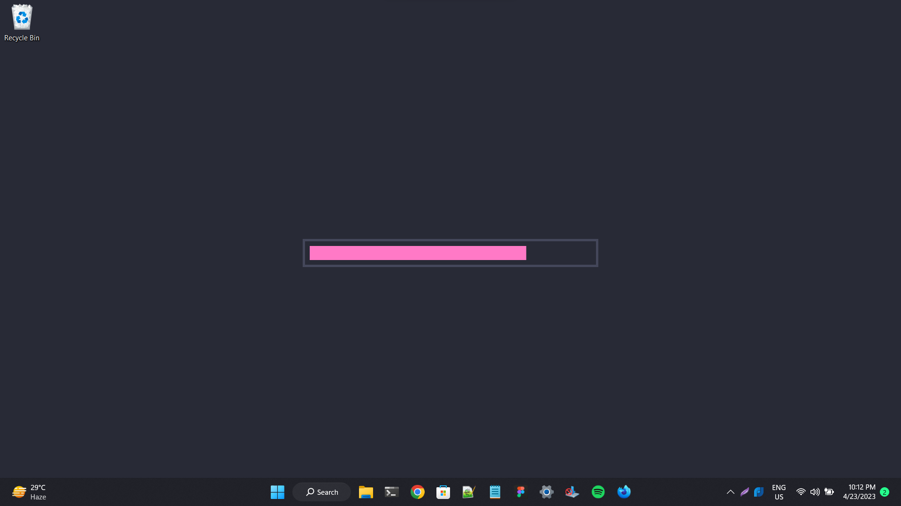

# timepaper

a customisable time progress bar on your desktop that can show the progress of year, month, day, hour and minute.



## installation

```
git clone https://github.com/tanmayrajk/timepaper.git
```

## usage

npm:

```
npm run start
```

pnpm:

```
pnpm run start
```

yarn:

```
yarn run start
```

## configuration

the wallpaper generated by the program can be customised in the `config.json` present in the `src` folder.

### options

-   `screen/width` - set it to the width of your screen in pixels.
-   `screen/height` - set it to the height of your screen in pixels.
-   `themes` - custom themes can be specified there in the same format as the default dracula theme.
-   `options/type` - the progress that the progress bar will measure. could be set to the following - `year, month, day, hour, minute`
-   `options/theme` - the theme you want to select from the `themes`.
-   `options/width` - width of the inside fill of the progress bar in pixels.
-   `options/height` - height of the inside fill of the progress bar in pixels.
-   `options/spacing` - spacing between the border and the fill on each side in pixels.
-   `options/border` - thickness of the border in pixels.
-   `refresh` - the duration in which the wallpaper will update in seconds. (read below)

## warning

for some reason, setting the wallpaper causes a lot of things to refresh (in windows atleast), and so refreshing every second can cause a lot of things to become unsuable, therefore, it's not reccomended to set the refresh to `1`.
